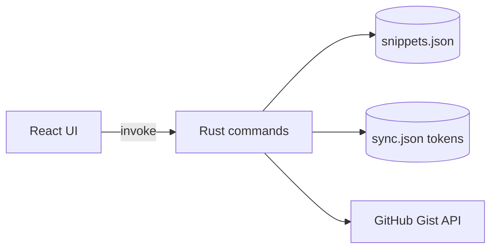

# Architecture

## Overview

Sniplet is a Tauri v2 hybrid app:

- **Frontend**: React 19 + TypeScript + Vite + MUI + Framer Motion
- **Backend**: Rust (snippet storage, clipboard, GitHub OAuth/sync)
- **Mobile**: Android WebView via Tauri mobile

## Data flow

## Sync model

- OAuth via GitHub **device flow** (mobile-friendly, no redirect URI)
- Snippets stored in a private Gist file `sniplet-snippets.json`
- Push overwrites remote; pull replaces local store

## Security

- Tokens stored via `tauri-plugin-store` in app data directory
- HTTP scoped to `github.com` and `api.github.com`
- Filesystem scoped to app data paths
