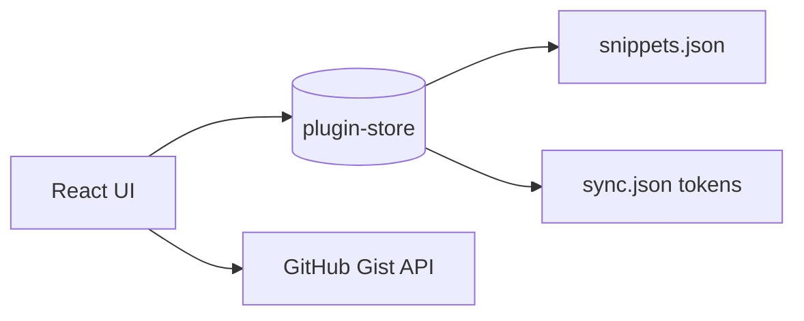

# Architecture

## Overview

Sniplet is a Tauri v2 hybrid app:

- **Frontend**: React 19 + TypeScript + Vite + MUI + Framer Motion
- **Backend**: Rust (Tauri plugins only: HTTP, store, clipboard)
- **Mobile**: Android WebView via Tauri mobile

## Data flow

## Sync model

- User pastes a GitHub **personal access token** (classic, `gist` scope) in the app
- Token stored locally via `tauri-plugin-store`
- Snippets stored in a private Gist file `sniplet-snippets.json`
- Push overwrites remote; pull merges into local store

## Security

- Tokens stored via `tauri-plugin-store` in app data directory
- HTTP scoped to `api.github.com`
- No OAuth client secrets or build-time GitHub credentials
